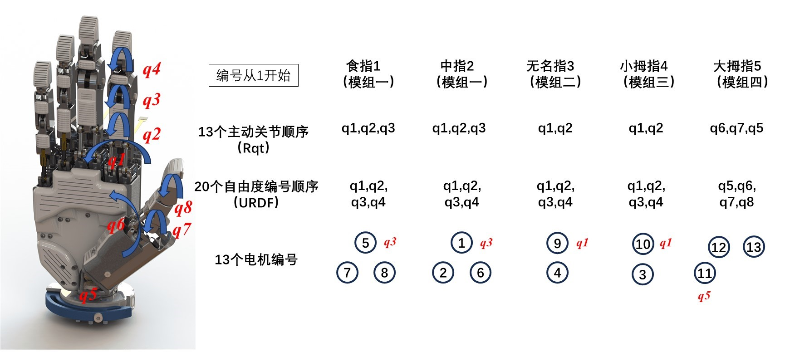

# freehand-controller

[](https://github.com/RichardLitt/standard-readme)

Controller for FreeHand

FreeHand机械手使用说明文档

## Table of Contents

- [Install](#install)
- [Usage](#usage)
- [API](#api)

## Install

在Ubuntu22.04上经过了测试，需要安装

* **ROS2 humble**
* Python3
* numpy
* scipy

关于ros2安装：可以使用鱼香ros安装,版本为humble
```
wget http://fishros.com/install -O fishros && . fishros 
```
或者找到fishros下载的文件，rename为fishros.sh，然后执行
```
sh ./fishros.sh 
```
在工作空间编译
```
colcon build --symlink-install
```
注意：
* `--symlink-install`对python文件创建链接，更改python节点无需重新编译
* 若在conda创建的虚拟环境中运行，需要在对应环境下编译，此时需要在虚拟环境下安装colcon-common-extensions
```
pip3 install colcon-common-extensions
```
* `source ./install/local_setup.zsh`或者`source ./install/local_setup.zsh`
* 连接后，需更改ip，与机械手在同一网段（例如：192.168.2.100）。**更改ip后请重新插拔**。

## Usage

* 基于ROS2 Rviz2的模型显示

```
ros2 launch freehand_description display.launch.py
```

* 基于ROS2 rqt的拖动控制

```
ros2 launch freehand_controller freehand_ros_driver_gui.launch.py
```

* freehand_controller功能包中的子文件夹freehand_controller可以独立于ROS2运行

```
cd ./src/freehand_controller/freehand_controller
python demo.launch
```

## API

所有接口都写在`hand_api.py`，通过构造`Hand`类进行调用，**部分函数还在更新中**

* `__init__(self, adjust_time=3, is_right=1):`
  * `adjust_time`：无名指和小拇指的测摆自由度初始位置由上电时刻决定，直到断电零位都不会变化，初始化也不会影响其零位。其他自由度理论上无需手动调整，因此调整时间可以设置较短。
* `start()`
  * 说明：启动并初始化
* `stop()`
  * 说明：暂停发送
* `close()`
  * 说明：关闭通信
* `create_timer()`和`transit_receive()`
  * 说明：使用定时函数进行底层通信，`transit_receive`按固定时间将self.cmd_发送至控制板，并将控制板上传的电机反馈保存在self.data_
  * TODO:固定时间目前为0.005s，还需要测试调整
* `set_motors_pos(pos)`
  * 功能：设置电机位置（测试使用，需要考虑减速比和编码器脉冲）
  * `pos`：编码器位置
* `set_motors_param(kp,kd)`
  * 功能：设置电机kp和kd，**不建议更改默认参数**
* `set_motors_pos_with_params(pos,kp,kd)`
  * 功能：设置电机位置和kp和kd，**不建议更改默认参数**
* `set_motor_force(tau)`
  * 功能：设置电机力，kp，kd为0。**还在更新，不建议使用**
* `set_joints_pos(joints)`
  * 功能：设置关节角度，然后根据逆解设置电机位置
  * `joints`：关节角度（rad）
* `get_motors_pos()`
  * 功能：获取电机编码器位置
* `get_joints_pos()`
  * 功能：获取关节角（rad）。**正解求解不稳定，暂不使用，没有关节差分速度**
* `action(action_name, delay)`
  * 说明：指定手势动作
* 底层函数（无需关注）
  * `set_motor_voltage()`
  * `set_mcu_enabled()`
  * `clear_enc()`
  * `set_motor_ctrl_param()`
  * `set_motor_enc_param()`
  * `set_motor_param()`
  * `set_motor_target()`

**运动学部分**

* 四杆机构关系，解算耦合关节
  * `four_bar_forward(q, A, B, C, D, degree1_init, degree2_init)`
  * `four_bar_backward(q, A, B, C, D, degree1_init, degree2_init)`
  * `four_bar_pip2dip(q,name)`:`name`是`index`，`middle`，`fourth`，`little`，`thumb`
  * `four_bar_dip2pip(q,name)`
  * `four_bar_mcp2pip(q,name)`:用于无名指和小拇指
  * `four_bar_pip2mcp(q,name)`:用于无名指和小拇指
* `ik_joints(q)`
  * 说明：逆运动学，从关节空间到执行器空间
  * 输入：关节参数`q`，13维，对应13个主动自由度

**机械手关节转向定义、手指与电机对应关系**

**用于判断接收到的关节反馈属于哪个电机/手指**



* 关节$q_2,q_3,q_4$向掌心为正，左右手一致

* 关节$q_1$为侧向运动，向掌心看去，右手逆时针为正，左手顺时针为正，上述定义与URDF定义一致

* 手指从食指开始编号，这由URDF文件决定，大拇指为4号（从0开始）

* 电机顺序与手指关节顺序不对应
  * 经函数`set_joints_pos()`处理后，13个关节角求解得到13个电机编码器位置，然后根据`map_motor`转换到电机id顺序
  * TODO：经函数`get_joints_pos()`处理后，电机顺序转换到手指关节顺序

* cfg.py:运动学参数

* model.py:无名指、小拇指逆运动学函数

* ExtCommProtocol.py:通信数据结构定义

## Change Log

### version:0.1.1

*October, 2022*

初始版

### version:0.1.2

*December, 2022*

* 使用线程函数进行发送与接收
* 完善手指逆运动学
### version:0.2.1

*July, 2023*

* 适配第三代手